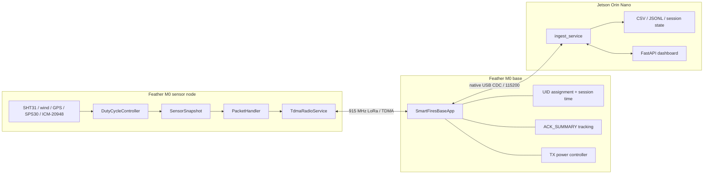
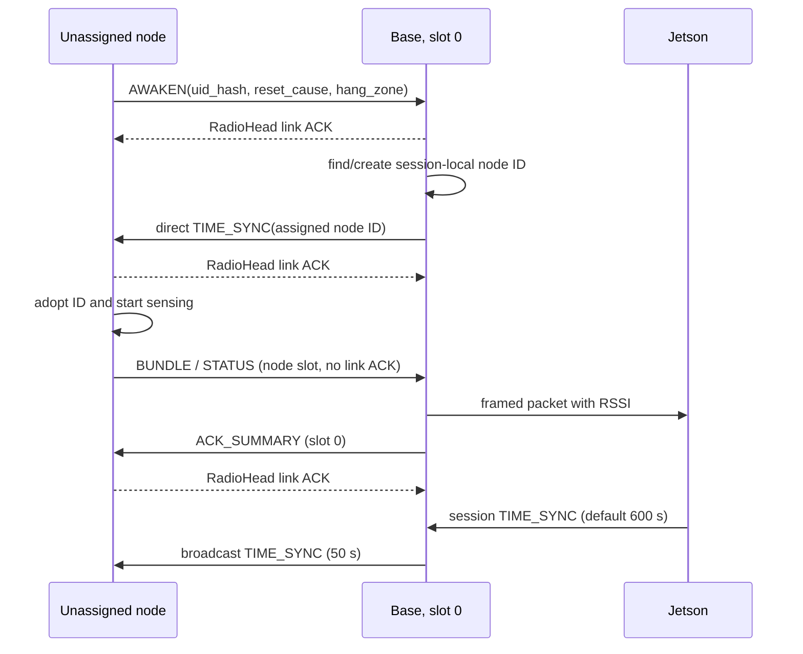
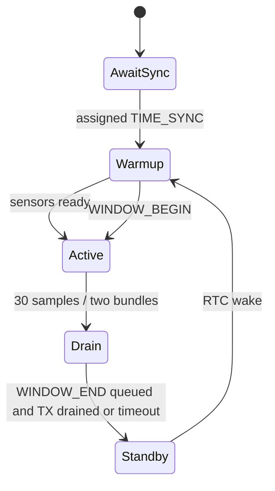
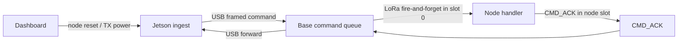

# SmartFires IoT software design diagrams

## System



## Join and steady state



## Timed node cycle



The nominal Timed period is 75 seconds: 10 seconds warmup, 30 seconds active sampling, and about 35 seconds standby. A five-second minimum standby and 15-second overrun ceiling protect the cycle when work runs late.

## Command paths



`CMD_RESET` to node 0 resets the base locally. A node hard reset sends its ACK immediately without a link ACK because a queued acknowledgement would be destroyed by the reset. `CMD_CALIBRATE` is protocol-complete but remains log-and-ACK; `/api/command` does not transmit it.

## Packet layers

```text
LoRa packet:
  [PktHeader:5][type-specific payload][CRC-8:1]

Base -> Jetson USB frame:
  [AA 55][len][RSSI:i8][complete LoRa packet][CRC-8]

Jetson -> Base USB frame:
  [AA 55][len][complete command or TIME_SYNC packet][CRC-8]
```

The base owns assignment, ACK summaries, and dynamic TX power. The Jetson owns persistence, wall-clock/session mapping, operator requests, and visualization.
