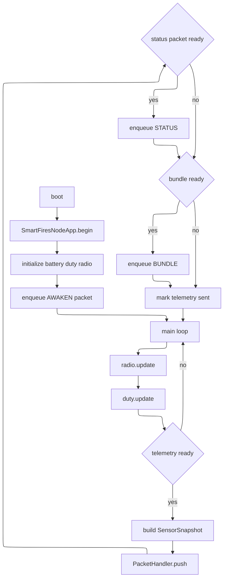
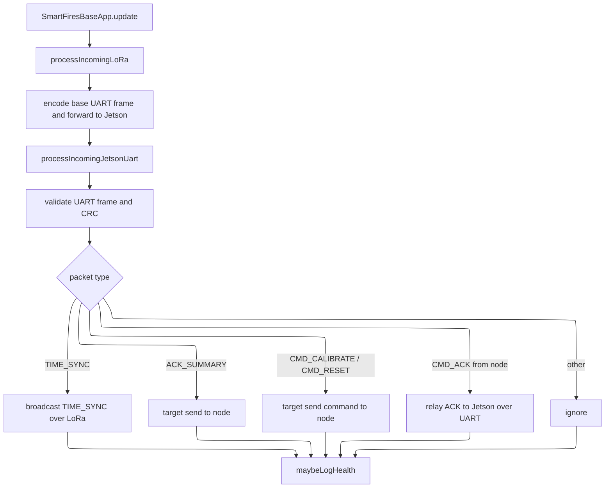
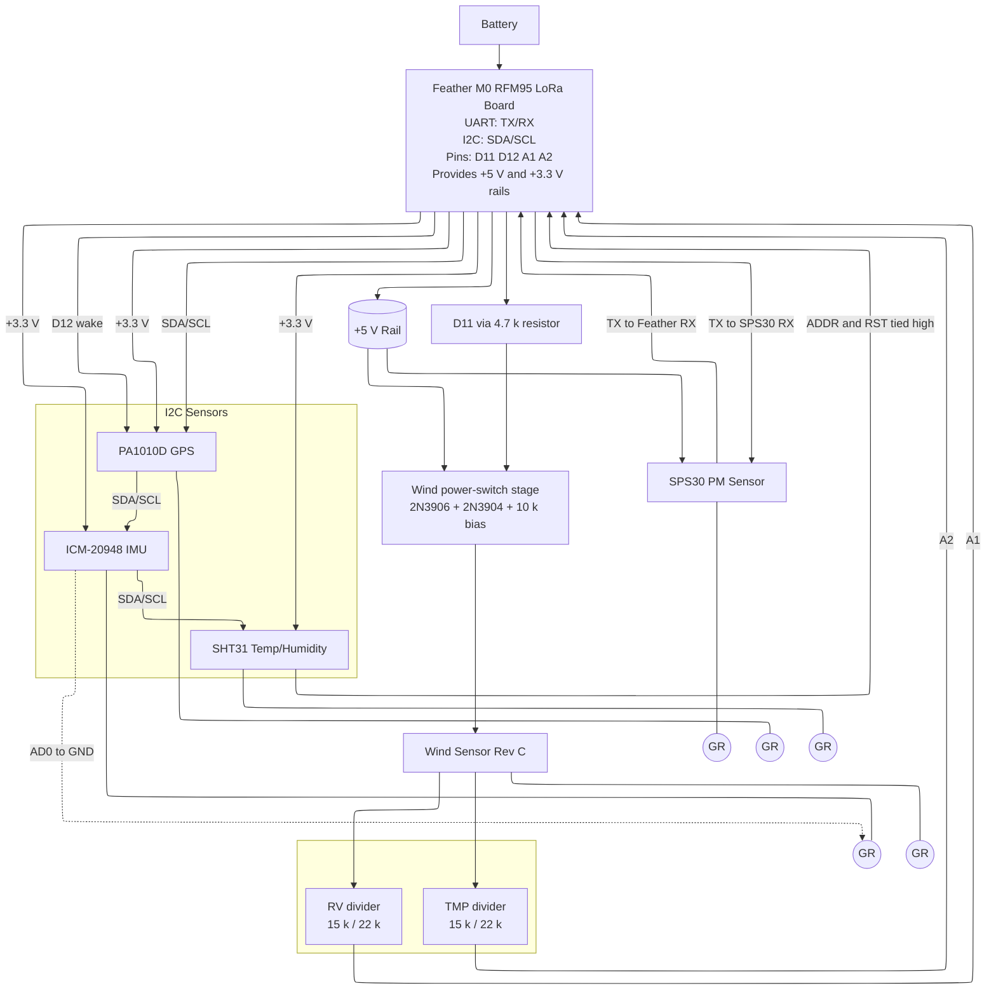

# SmartFires IoT Software Design Diagram

## System Diagram

```mermaid
%%{init: {"flowchart": {"defaultRenderer": "elk"}} }%%
flowchart LR
    subgraph Node[Feather M0 Node]
        Sensors[Sensors\nSHT31 GPS Wind SPS30 IMU]
        Duty[DutyCycleController]
        App[SmartFiresNodeApp]
        Snapshot[SensorSnapshot]
        Handler[PacketHandler]
        Clock[TdmaClock]
        Queue[TdmaTxQueue]
        RadioSvc[TdmaRadioService]
        DriverNode[RadioHeadTdmaDriver]
        Battery[BatteryMonitor]

        Sensors --> Snapshot
        Battery --> Snapshot
        Duty --> App
        App --> Snapshot
        Snapshot --> Handler
        Clock --> App
        Clock --> RadioSvc
        Handler --> Queue
        Queue --> RadioSvc
        RadioSvc --> DriverNode
        App --> RadioSvc
    end

    subgraph Air[LoRa 915 MHz]
        LoRa[(TDMA Channel)]
    end

    subgraph Base[Feather M0 Base Station]
        DriverBase[RadioHeadTdmaDriver]
        BaseApp[SmartFiresBaseApp]
        UartBridge[UART Framing and Parsing]

        DriverBase --> BaseApp
        BaseApp --> UartBridge
        UartBridge --> BaseApp
    end

    subgraph Jetson[Jetson Orin Nano]
        Ingest[ingest_service.py]
        Decode[packet.py decode and bundle expansion]
        Csv[CSV logging]
        Sync[TIME_SYNC generation]
        Anemometer[Optional anemometer polling]
        Web[web/app.py FastAPI dashboard\nmap, telemetry charts, command POST]
        Sniffer[sniffer_service.py\noptional passive sniffer Feather]

        Ingest --> Decode
        Decode --> Csv
        Sync --> Ingest
        Anemometer --> Csv
        Ingest --> Web
        Sniffer --> Web
    end

    DriverNode --> LoRa
    LoRa --> DriverBase
    UartBridge --> Ingest
    Ingest --> UartBridge
```

## Node Control Flow

## Base Station Control Flow

## Node Hardware Diagram

The diagram below is a clean reconstruction of the current node wiring draft from the whiteboard. It should be treated as an implementation guide, not as a PCB-ready schematic. The wind-sensor power switching block in particular should be checked against the final breadboard before fabrication.

## Node Wiring Notes

- `Battery` feeds the Feather LoRa board directly.
- Ground is shown as short per-device tails rather than as a shared ground rail, to match the whiteboard sketch more closely.
- The Feather LoRa board is shown as the source of the distributed `+5 V` and `+3.3 V` connections.
- `GPS`, `IMU`, and `SHT31` share the Feather I2C connection directly, shown as a loop across the sensor row rather than as a separate bus block, and appear to run from `+3.3 V`.
- `GPS wake` is drawn to Feather `D12`.
- `SPS30` is drawn on UART with crossed TX/RX and `VIN` tied to `+5 V`; the whiteboard also calls out a logic-level question that should be verified during bring-up.
- `IMU AD0` is shown tied to ground.
- `SHT31 ADDR` and `RST` are shown tied high to `+3.3 V`.
- The wind sensor block is drawn with a transistor-switched supply driven from `D11` through a `4.7 k` resistor, using `2N3906` and `2N3904` transistors plus a `10 k` bias resistor.
- Wind sensor outputs labeled `RV` and `TMP` are drawn into Feather analog inputs `A1` and `A2` through resistor-divider networks labeled `15 k` and `22 k`.
- Final resistor values and transistor orientation should be checked against the actual node prototype before treating this as authoritative hardware documentation.
