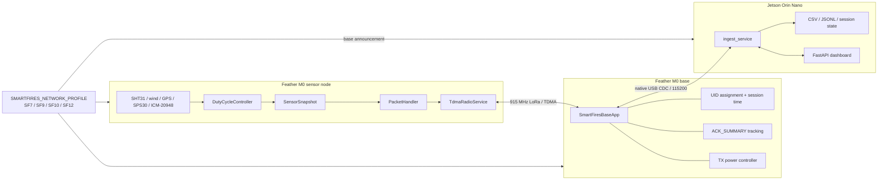
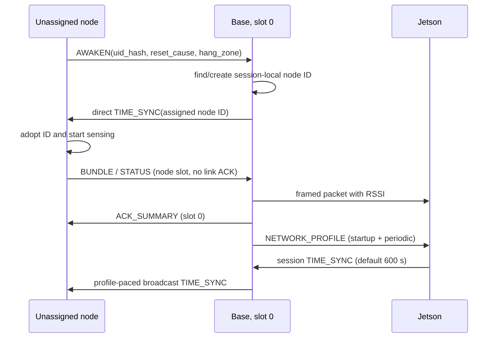
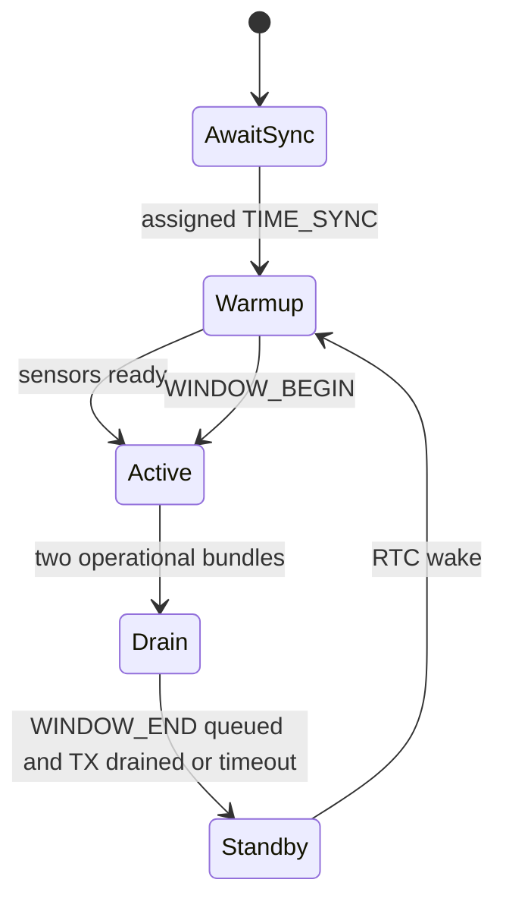
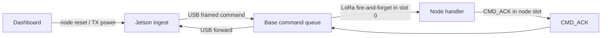

# SmartFires IoT software design diagrams

## System


```mermaid
flowchart LR
    Profile[SMARTFIRES_NETWORK_PROFILE\nSF7 / SF9 / SF10 / SF12]
    subgraph Node[Feather M0 sensor node]
        Sensors[SHT31 / wind / GPS / SPS30 / ICM-20948]
        Duty[DutyCycleController]
        Snapshot[SensorSnapshot]
        Packets[PacketHandler]
        Tdma[TdmaRadioService]
        Sensors --> Duty --> Snapshot --> Packets --> Tdma
    end

    subgraph Base[Feather M0 base]
        BaseApp[SmartFiresBaseApp]
        Assign[UID assignment + session time]
        Ack[ACK_SUMMARY tracking]
        Power[TX power controller]
        BaseApp --- Assign
        BaseApp --- Ack
        BaseApp --- Power
    end

    subgraph Jetson[Jetson Orin Nano]
        Ingest[ingest_service]
        Store[CSV / JSONL / session state]
        Web[FastAPI dashboard]
        Ingest --> Store
        Ingest <--> Web
    end

    Tdma <-->|915 MHz LoRa / TDMA| BaseApp
    BaseApp <-->|native USB CDC / 115200| Ingest
    Profile --> Node
    Profile --> Base
    Profile -->|base announcement| Jetson
```

## Join and steady state


```mermaid
sequenceDiagram
    participant N as Unassigned node
    participant B as Base, slot 0
    participant J as Jetson

    N->>B: AWAKEN(uid_hash, reset_cause, hang_zone)
    B->>B: find/create session-local node ID
    B->>N: direct TIME_SYNC(assigned node ID)
    N->>N: adopt ID and start sensing
    N->>B: BUNDLE / STATUS (node slot, no link ACK)
    B->>J: framed packet with RSSI
    B->>N: ACK_SUMMARY (slot 0)
    B->>J: NETWORK_PROFILE (startup + periodic)
    J->>B: session TIME_SYNC (default 600 s)
    B->>N: profile-paced broadcast TIME_SYNC
```

## Timed node cycle


```mermaid
stateDiagram-v2
    [*] --> AwaitSync
    AwaitSync --> Warmup: assigned TIME_SYNC
    Warmup --> Active: sensors ready
    Active --> Drain: two operational bundles
    Drain --> Standby: WINDOW_END queued and TX drained or timeout
    Standby --> Warmup: RTC wake
    Warmup --> Active: WINDOW_BEGIN
```

Timed profile periods are 75/80/90/150 seconds for SF7/SF9/SF10/SF12. The active window is two complete operational bundles: 30 samples at the shorter profiles and 16 samples at SF12. Profile-scaled overrun and final-drain limits protect the cycle when work runs late.

## Command paths


```mermaid
flowchart LR
    UI[Dashboard]
    Ingest[Jetson ingest]
    Base[Base command queue]
    Node[Node handler]
    Ack[CMD_ACK]

    UI -->|node reset / TX power| Ingest
    Ingest -->|USB framed command| Base
    Base -->|LoRa fire-and-forget in slot 0| Node
    Node -->|CMD_ACK in node slot| Ack --> Base -->|USB forward| Ingest
```

`CMD_RESET` to node 0 resets the base locally. A node hard reset sends its ACK immediately without a link ACK because a queued acknowledgement would be destroyed by the reset. `CMD_CALIBRATE` is protocol-complete but remains log-and-ACK; `/api/command` does not transmit it.

## Packet layers

```text
LoRa packet:
  [PktHeader:5][type-specific payload][CRC-8:1]

Base -> Jetson USB frame:
  [AA 55][len][RSSI:i8][complete LoRa packet][CRC-8]
  NETWORK_PROFILE uses the same envelope with a fixed control payload and RSSI=0.

Jetson -> Base USB frame:
  [AA 55][len][complete command or TIME_SYNC packet][CRC-8]
```

The base owns assignment, ACK summaries, the authoritative active-profile announcement, and dynamic TX power. The Jetson owns persistence, wall-clock/session mapping, operator requests, and profile-driven visualization.
